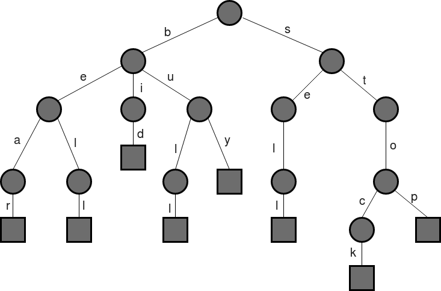
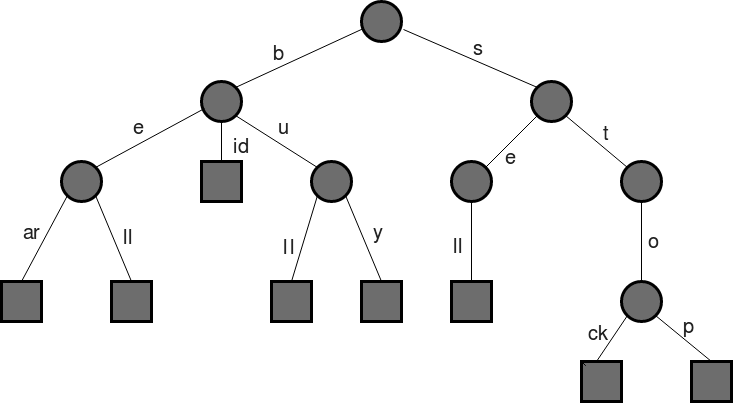
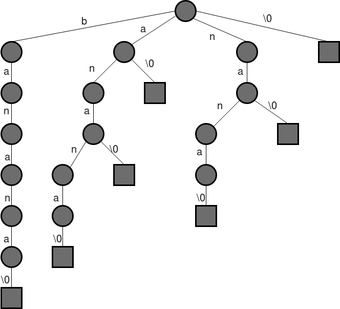
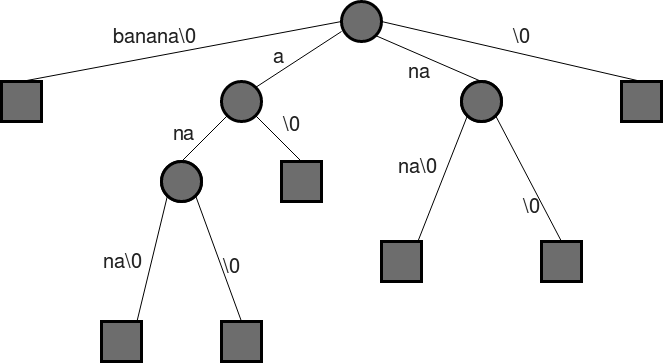

# Suffix Tree - Cây hậu tố
## I. Giới thiệu cây hậu tố

### 1. Bài toán cần giải quyết.
Cho một đoạn văn bản *text* độ dài **n** và một chuỗi ký tự *pattern* độ dài **m**. Hãy viết một hàm tìm kiếm *search*(String *pattern*, String *text*) trả về số lần xuất hiện của chuỗi ký tự *pattern* trong *text*. Giả sử rằng độ dài của *pattern* nhỏ hơn nhiều so với text, **n** >> **m**.

Thoạt nhiên bài toán này không quá khó khi chúng ta có thể xử lý ngay bằng cách so sánh ký tự trong hai vòng lặp lồng nhau với độ phức tạp là *O(n**m)*. Tuy nhiên khi đối mặt với text và pattern có độ dài lớn thì chúng ta cần nhanh hơn nữa. Một vài giải thuật được đề xuất có thể kể đến là [KMP](https://www.geeksforgeeks.org/archives/11902), [Rabin Karp](https://www.geeksforgeeks.org/archives/11937), [Finite Automata](https://www.geeksforgeeks.org/archives/18919) và [Boyer Moore](https://www.geeksforgeeks.org/pattern-searching-set-7-boyer-moore-algorithm-bad-character-heuristic/). Bằng cách bỏ ra *O(m)* để tiền xử lý *pattern* các giải thuật này có thể đạt đến tốc độ tìm kiếm là *O(n)*, với m là độ dài của *pattern* và n là độ dài của *text*. Tổng lại ta sẽ có *O(m+n)* cho cả tiền xử lý và tìm kiếm. Có thể nói tốc độ tuyến tính này đã là tối ưu nhất cho bài toán đặt ra. Thế chúng ta còn cần cây hậu tố làm gì?

Mọi chuyện chỉ bắt đầu thú vị khi bài toán được mở rộng hơn. Bây giờ giả sử chúng ta không chỉ có một *pattern* mà chúng ta có một mảng *patterns* gồm có **k** *pattern* trong đó thì sao. Như vậy chúng ta cần phải thêm một vòng lặp nữa bên ngoài những giải thuật trên và độ phức tạp cho bài toán mới sẽ là *O(k* * *(m + n))*. Đây chính là nơi cho mảnh hậu tố nhảy vào vì nó có thể giúp chúng ta giải quyết bài toán này với tốc độ *O(k* * *m + n)*, để hiểu tốc độ đã tăng lên rất nhiều thì chúng ta cần lưu ý rằng **m** rất nhỏ so với **n**. Đây sẽ là một hành trình dài và trước hết chúng ta cần biết mảng hậu tố là gì.

### 2. Mảng hậu tố là gì?
Nói một cách đơn giản, cây hậu tố của một văn bản là một cấu trúc *trie rút gọn* chứa tất cả các hậu tố của văn bản đó. Trước tiên chúng ta sẽ cần một chút kiến thức về cấu trúc *trie thường* [ở đây](https://www.geeksforgeeks.org/trie-insert-and-search/). Giờ hãy tìm hiểu khái niệm *trie rút gọn* là gì với mảng gồm các chuỗi sau:

>`{bear, bell, bid, bull, buy, sell, stock, stop}`

Từ mảng trên ta có thể xây dựng một cấu trúc trie bình thường như sau:

Giờ hãy xem tiếp cấu trúc trie rút gọn của mảng trên sẽ khác như thế nào?

Vâng! Đúng rồi đấy, các nút trong *trie rút gọn* sẽ ngừng mở rộng thêm khi biết rằng hậu duệ của nó chỉ có duy nhất một lá.

Quay trở lại với cây hậu tố. Ví dụ khi phân tích một chuỗi cho trước là `banana\0`, `\0` là ký tự kết thúc chuỗi, thì ta sẽ thu được các hậu tố sau: 

>`banana\0` 
>`anana\0` 
>`nana\0` 
>`ana\0` 
>`na\0` 
>`a\0` 
>`\0`

Khi đem tất cả bỏ vào một *trie* thường ta sẽ được:

Và nếu rút gọn *trie* trên, cấu trúc mới sẽ ít tốn không gian hơn.

## 2. Ứng dụng suffix tree
## 3. Xây dựng suffix tree

## Tham khảo
1. [Pattern Searching | Set 8 (Suffix Tree Introduction)](https://www.geeksforgeeks.org/pattern-searching-set-8-suffix-tree-introduction/)