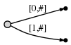
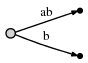
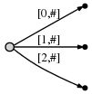
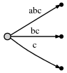
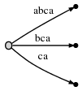
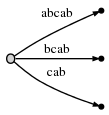

# Cây hậu tố - Suffix Tree
## I. Giới thiệu cây hậu tố

### 1. Bài toán cần giải quyết.
Cho một đoạn văn bản *text* độ dài **n** và một chuỗi ký tự *pattern* độ dài **m**. Hãy viết một hàm tìm kiếm *search*(String *pattern*, String *text*) trả về số lần xuất hiện của chuỗi ký tự *pattern* trong *text*. Giả sử rằng độ dài của *pattern* nhỏ hơn nhiều so với text, **n** >> **m**.

Thoạt nhiên bài toán này không quá khó khi chúng ta có thể xử lý ngay bằng cách so sánh ký tự trong hai vòng lặp lồng nhau với độ phức tạp là *O(n**m)*. Tuy nhiên khi đối mặt với text và pattern có độ dài lớn thì chúng ta cần nhanh hơn nữa. Một vài giải thuật được đề xuất có thể kể đến là [KMP](https://www.geeksforgeeks.org/archives/11902), [Rabin Karp](https://www.geeksforgeeks.org/archives/11937), [Finite Automata](https://www.geeksforgeeks.org/archives/18919) và [Boyer Moore](https://www.geeksforgeeks.org/pattern-searching-set-7-boyer-moore-algorithm-bad-character-heuristic/). Bằng cách bỏ ra *O(m)* để tiền xử lý *pattern* các giải thuật này có thể đạt đến tốc độ tìm kiếm là *O(n)*, với m là độ dài của *pattern* và n là độ dài của *text*. Tổng lại ta sẽ có *O(m+n)* cho cả tiền xử lý và tìm kiếm. Có thể nói tốc độ tuyến tính này đã là tối ưu nhất cho bài toán đặt ra. Thế chúng ta còn cần cây hậu tố làm gì?

Mọi chuyện chỉ bắt đầu thú vị khi bài toán được mở rộng hơn. Bây giờ giả sử chúng ta không chỉ có một *pattern* mà chúng ta có một mảng *patterns* gồm có **k** *pattern* trong đó thì sao. Như vậy chúng ta cần phải thêm một vòng lặp nữa bên ngoài những giải thuật trên và độ phức tạp cho bài toán mới sẽ là *O(k* * *(m + n))*. Đây chính là nơi cho mảnh hậu tố nhảy vào vì nó có thể giúp chúng ta giải quyết bài toán này với tốc độ *O(k* * *m + n)*, để hiểu tốc độ đã tăng lên rất nhiều thì chúng ta cần lưu ý rằng **m** rất nhỏ so với **n**. Đây sẽ là một hành trình dài và trước hết chúng ta cần biết mảng hậu tố là gì.

### 2. Mảng hậu tố là gì?
Nói một cách đơn giản, cây hậu tố của một văn bản là một cấu trúc *trie rút gọn* chứa tất cả các hậu tố của văn bản đó. Trước tiên chúng ta sẽ cần một chút kiến thức về cấu trúc *trie thường* [ở đây](https://www.geeksforgeeks.org/trie-insert-and-search/). Giờ hãy tìm hiểu khái niệm *trie rút gọn* là gì với mảng gồm các chuỗi sau:

>`{bear, bell, bid, bull, buy, sell, stock, stop}`

Từ mảng trên ta có thể xây dựng một cấu trúc trie bình thường như sau:

Giờ hãy xem tiếp cấu trúc trie rút gọn của mảng trên sẽ khác như thế nào?

Vâng! Đúng rồi đấy, các nút trong *trie rút gọn* sẽ ngừng mở rộng thêm khi biết rằng hậu duệ của nó chỉ có duy nhất một lá.

Quay trở lại với cây hậu tố. Ví dụ khi phân tích một chuỗi cho trước là `banana\0`, `\0` là ký tự kết thúc chuỗi, thì ta sẽ thu được các hậu tố sau: 

>`banana\0` 
>`anana\0` 
>`nana\0` 
>`ana\0` 
>`na\0` 
>`a\0` 
>`\0`

Khi đem tất cả bỏ vào một *trie* thường ta sẽ được:

Và nếu rút gọn *trie* trên, cấu trúc mới sẽ ít tốn không gian hơn.

Đến đây ta có thể dễ dàng hình dung hơn cây hậu tố là như thế nào rồi. Xin chú ý là phần giới thiệu này chỉ đang xây dựng cây hậu tố bằng tay, cụ thể cách để xây dựng cây hậu tố thế nào thì sẽ được trình bày ở phần sau.

Giờ lại nảy ra câu hỏi là giả sử ta có cây hậu tố rồi thì sẽ sử dụng nó như thế nào cho bài toán đặt ra? Rất đơn giản! Nó không khác với trie là mấy. Với mỗi một chuỗi *pattern* bạn sẽ bắt đầu đi từ gốc của cây hậu tố, duyệt qua từng cạnh tương ứng với từng ký tự của *pattern*. Nếu ta không dò được cạnh để đi thì có nghĩa là chuỗi *pattern* không xuất hiện trong *text*. Nếu ta có thể duyệt qua hết tất cả các ký tự của *pattern* thì *pattern* đã xuất hiện đâu đó trong *text*.

Để dễ hình dung, giả sử biết chuỗi `nan` có xuất hiện trong `banana` hay không. Ta sẽ duyệt theo đường màu đó của hình sau:

Đây chỉ là bài toán kinh điển cho cây hậu tố. Sẽ còn nhiều ứng dụng thú vị khác sẽ được trình bày ở phần 3.

## 2. Ứng dụng suffix tree

Cây hậu tố rất hữu ích trong xử lý chuỗi và nhiều bài toán trong lĩnh vực tính toán sinh học. Nhiều sách và tài liệu trên mạng nói về nó và ở một vài chỗ còn có code cài đặt. Tuy nhiên, tôi vẫn cảm thấy là vẫn chưa đủ và code cài đặt không hề dễ để đưa vào sử dụng. Vậy nên bài viết này sẽ cố gằng để thu hẹp khoảng cách giữa lý thuyết và ứng dụng thực tế. Chúng ta sẽ cùng nhau tìm hiều về giải thuật dụng cây hậu tố có tên là Ukkonen. Ta sẽ đi chi tiết từng bước một nhiều phần từ lý thuyết đến cài đặt. Bắt đầu từ phương pháp "dùng sức" để hiểu rõ những khái niệm và mẹo trong giải thuật Ukkonen. Và cuối cùng ta sẽ thực hiện cài đặt giải thuật này.

## 3. Xây dựng suffix tree

### a. Dựng cây hậu tố bằng "sức".
### b. Dựng cây hậu tố bằng giải thuật Ukkonen.
Để có thể hiểu rõ giải thuật xây dựng cây hậu tố O(n) chúng ta sẽ đi từng bước một. Xử lý từ chuỗi đơn giản nhất, chuỗi không lặp, dần dần đến chuỗi phức tạp hơn. Ta hãy bắt đầu từ những khái niệm cơ bản.

1. Thứ chúng ta xây dựng gần giống như trie. Sẽ có một nút gốc (root), từ nút gốc sẽ có những cạnh nối đến các nút mới và cứ đi tiếp như thế cho đến nút lá.
2. Thứ chúng ta xây dựng không hoàn toàn giống với trie. Các cạnh sẽ không được biểu diễn bằng ký tự (trie) hay chuỗi ký tự ( trie nén) mà sẽ bằng một cặp số [start,end] là vị trí đầu và cuối của chuỗi con trong văn bản *text*. Đây là cách để tiết kiệm không gian lưu trữ khi chũng ta chỉ hoạt động trên đúng một text. Ta sẽ thấy cách biểu diễn rất hữu ích khi chạy giải thuật Ukkonen.
3. Ta cần nhớ một điều. Tư tưởng chính của giải thuật Ukkonen là đệ quy. Tư tưởng này có thể hoàn toàn trái ngược với cách dùng "sức" mà ta dễ dàng nghĩ ra. Nhiệm vụ ở đây rất đơn giản, giả sử bạn đã có cây nhị phân cho chuỗi tiền số *text[0...i]* giờ hãy xây dựng cây nhị phân cho chuỗi tiền tố *text[0...i+1]*. Đó là ý tưởng, còn làm thế nào thì ta sẽ bắt đầu ngay sau đây.

#### Chuỗi không lặp

Giờ ta hãy bắt đầu với chuỗi
>`abc`
Như đã nói, giờ ta sẽ bắt đầu xây dựng từ chuỗi tiền tố `a` trước. Ta sẽ tạo một cạnh [0,#], # ở đây đại diện cho vị trí ký tự cuối cùng ở thời điểm hiện tại, ở đây nó là 1. Có thể hiểu là các ký tự từ 0 đến nhỏ hơn 1, ở đây là `a`.
Ta sẽ khởi tạo cây:

Biểu diễn cho:

Giờ ta sẽ thêm `b` vào để xây dựng cây hậu tố cho chuỗi `ab`.
Những việc ta cần làm đó là.
1. Mở rộng cạnh `a` đã có thành cạnh `ab`.
2. Thêm một cạnh `b` vào cấu trúc trie.

Cây hậu tố mới sẽ là.

Biểu diễn cho:

Đến đây ta có thể đã nhận ra vài thứ
* Việc biểu diễn cạnh `ab` bằng một cặp số [0,#] vẫn được giữ lại như ở cây hậu tố trước đó. Nó chỉ khác là giá trị của # đã được cập nhật từ 1 lên thành 2. 
* Không cần biết là có bao nhiêu ký tự, khi sử dụng một cặp số để biểu diễn cạnh, ta luôn luôn chỉ tốn O(1) cho việc lưu trữ.

Ta lại tiếp tục tăng vị trí hiện tại lên để thêm ký tự cuối cùng `c` vào các cạnh đã có  và sau đó thêm cạnh mới `c`. Ta thu được cây hậu tố mới.

Cây hậu tố mới sẽ là.

Biểu diễn cho:

Giờ tổng hợp lại ta thấy gì:
* Dựng cây đến đâu thì chúng ta cập nhật vị trí hiện tại # tới đó.
* Số bước cũng chính bằng chiều dài của chuỗi *text*
* Ở mỗi bước ta chỉ thực hiện đúng 2 việc là cập nhật # và thêm cạnh mới vào. Mỗi thao tác tiêu tốn O(1). Như vậy chi phí để hoàn thành cây hậu tố cho chuỗi *text* dài n là O(n).

#### Mở rộng thứ nhất: chuỗi lặp đơn giản.

Đương nhiên trong thực tế ta sẽ hiếm khi gặp được chuỗi đơn giản như ở phần trước. Thực tế sẽ trông như thế này.

>`abcabxabcd`

Ta sẽ dựng cây hậu tố cho chuỗi trên từng bước.

**Bước 1-3**: Ta thực hiện như phần trước để được cây sau:

**Bước 4**: Đầu tiên ta sẽ tăng vị trí hiện tại # lên một, để có được cây mới biểu diển cho

Việc tiếp theo ta sẽ thêm cạnh mới là `a` vào gốc `root`. Trước khi làm điều đó, ta cần thêm một biến phụ bên cạnh #. Ta sẽ gọi nó là `active point`, gồm bộ ba giá trị `(active_node, active_edge, active_length)`. Ta sẽ thấy rõ tác dụng của nó sau, hiện tại chỉ cần biết rằng trong trường hợp `abc` thì `active point` luôn luôn là `(root,'\0x',0)` với ý nghĩa `active_node` là root, `active_edge` là một ký tự null `'\0x'` và `active_length` là không.

Quay trở lại với việc thêm cạnh `a` vào gốc. Để ý rằng ta đã có sẵn cạnh `a`, nằm trên `abca` đi ra từ nút gốc. Để xử lý trường hợp này việc chúng ta sẽ làm là
* Ta không thêm cạnh mới [4,#] vào nút gốc. Ta chỉ để ý rằng hậu tố `a` đã có sẵn và cạnh của nó kết thúc ở đâu đó trên cây. Chúng ta sẽ không làm gì với cây hậu tố.
* Biến `active point` sẽ được cập nhật lại thành `(root,'a',1)`, hàm ý là `active point` bắt đầu từ nút gốc, đang nằm ở giữa một cạnh nào đó bắt đầu với ký tự `a` và nằm sau vị trí 1 trên cạnh đó. Chú ý rằng ở đây ta chỉ cần biết ký tự đầu tiên để đại diện cho một cạnh bởi vì những cạnh khác nhau sẽ bắt đầu với những ký tự khác nhau.

**Quan sát**: Khi một hậu tố cần thêm vào đã có sẵn trên cây thì ta sẽ không động chạm gì đến nó mà chỉ thay đổi giá trị của `active point`. Cây này không phải là cây hậu tố đùng nghĩa nhưng nó chứa hết tất cả các hậu tố. Ta gọi đây là cây hậu tố không tường minh hay implicit suffix tree. Hầu như công việc phải làm chỉ là cập nhật lại `active point` nên chi phí cần bỏ ra cho thao tác này là O(1).

**Bước 5**: Như thường lệ, ta tăng vị trí hiện tại lên # để thu được câu hậu tố

Có thể thấy ta cần thêm hai hậu tố mới là `ab` và `a` vào cây trên.
*  

## Tham khảo
1. [Pattern Searching | Set 8 (Suffix Tree Introduction)](https://www.geeksforgeeks.org/pattern-searching-set-8-suffix-tree-introduction/)
2. [Ukkonen's suffix tree algorithm in plain English](https://stackoverflow.com/questions/9452701/ukkonens-suffix-tree-algorithm-in-plain-english)